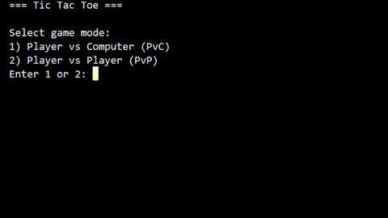

# TicTacToe


## Table of Contents

- [About](#about)
- [Demo](#demo)
- [Features](#features)
- [Tech & Concepts](#tech--concepts)
- [Repository structure](#repository-structure)
- [Quick start](#quick-start)
- [How to play](#how-to-play)
- [AI](#ai)
- [Running tests](#running-tests)
- [Next steps](#next-steps)
- [License](#license)
- [Author / Contact](#author--contact)

## About

TicTacToe is a clean, well-documented implementation of the classic 3×3 game written in Python.
I built this project to practice object-oriented programming (OOP) and to learn basic AI concepts — specifically the minimax algorithm.

## Demo


## Features

- Game modes: Local PvP (Player vs Player) and PvC (Player vs Computer)
- "Computer" difficulty (Easy / Normal / Hard)
  - Hard uses Minimax (optimal play) with:
    - Alpha–Beta pruning (search optimization)
    - Depth-weighted evaluation (prefer faster wins, delay defeats)
- Choice of symbol (X or O) and who plays first
- Win/draw detection and move validation
- Customizable victory/defeat/draw messages (from `messages.py`)
- Replay option
- Unit tests covering game logic

## Tech & Concepts

- Language: Python 3.13.6
- Libraries: `numpy`, `random`, `unittest`
- Keywords: Command-Line Interface (CLI), turn-based game, Minimax

## Repository structure
```
tictactoe/
├── tictactoe.py # main executable
├── messages.py # strings/messages used by the CLI
├── tests/
│ └── test_tictactoe.py
├── assets/
│ ├── demo.gif
│ └── banner.png
├── .gitignore
├── README.md
└── LICENSE
```

## Quick start

1. Clone the repository

```bash
git clone git@github.com:VictorLiotti/tictactoe.git
cd tictactoe
```

2. Run the game
```
python tictactoe.py
```

## How to play

### Board

The board is a 3x3 grid numbered from 1 to 9

```
 1 | 2 | 3
-----------
 4 | 5 | 6
-----------
 7 | 8 | 9
```

### Rules

Each turn a player chooses an available position on the board to put its symbol there.

Positions marked with a symbol are no longer available.

The player that fills a whole row, column or diagonal with its symbol wins.

If there are no available positions left and nobody won, then its a draw.


### Playing

The game runs in the terminal (CLI).

Initially, you will be asked about game mode.

- If you choose PvP you are ready to go: PvP is local. Player 1 plays first and uses symbol X, Player 2 uses symbol O.
- If you choose PvC:
 - You will be asked about computer opponent difficulty: Easy, Normal or Hard.
  - Easy mode: computer plays randomly the whole game.
  - Normal mode: computer plays randomly untill it identify a trivial play: immenent victory or defeat. In that case it makes the optimum play.
  - Hard mode: computer uses minimax algorithm to decide the optimum plays all the time. It won't lose. You can read more about it in [AI](#ai) section.
 - You will have to choose which symbol you want to play with (X or O) and who plays first.

On each turn a player chooses an available position on the board and type the corresponding number to place its symbol (X or O) there. The board will be printed on the terminal.

When the game ends, you will can may choose replay for a playing it again.


## AI

The computer opponent uses the **minimax algorithm**, a recursive search method commonly applied in turn-based games. The idea is simple: simulate all possible moves ahead and pick the one that guarantees the best outcome assuming the opponent also plays optimally.

Each simulated move creates a new board state, also called a *node*. If moves are still available, new child nodes are generated, forming a game tree. The tree ends at *terminal states* (or leaves) — win, loss, or draw.

At the leaves, scores are assigned: in this project **+10 for a win, –10 for a loss, and 0 for a draw**. The raw scores are also **depth-weigthed** to differentiate between faster and slower outcomes:
- **Faster wins** (fewer moves) get higher scores, e.g. `10 – depth`.
- **Slower defeats** (more moves before losing) get less negative scores, e.g. `depth – 10`.
- Draws remain at 0.

These base values are arbitrary and can be tuned for different games, but the relative order must be preserved — ensuring that, even after depth weighting, **victory > draw > defeat** in all scenarios.

The algorithm then works backwards (backpropagation). Starting from the deepest depth:
- If it is the **computer’s turn (MAX)**, the node takes the *maximum* value of its children.
- If it is the **player’s turn (MIN)**, the node takes the *minimum* value of its children.

This alternation continues up the tree until depth 0, where the root node corresponds to the current board. The move leading to the best score at the root is chosen as the optimal play.

This max–min alternation explains the name **Minimax**.  
- **MAX (computer)** tries to maximize the score.  
- **MIN (player)** tries to minimize the score.

By default, minimax explores the entire tree. However, many branches can be ignored without changing the result by using **alpha–beta pruning**. Alpha (best already guaranteed for MAX) and beta (best already guaranteed for MIN) act as bounds. If a branch cannot possibly improve the outcome, it is cut off. This greatly reduces the number of nodes explored, making the algorithm faster and more efficient.

## Running tests

This project includes unit tests to validate the game logic.

Using unittest (built-in):
```
python -m unittest discover -v
```

## Next steps

> Not necessarily in priority order

- Add GUI (Tkinter, Pygame, or web-based demo).
- Change difficulty levels for AI by limiting search depth.
- Add remote online PvP
- Customizable symbols
- Separate completly the UI and game engine

## License

This project is MIT licensed.


## Author / Contact

Víctor L. - [Github](https://github.com/VictorLiotti) - [Linkedin](www.linkedin.com/in/victor-liotti)